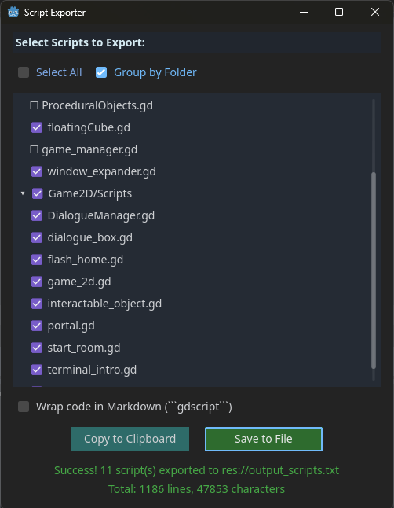

# Godot Script Exporter Plugin
This repository contains the source code for the "Script Exporter" plugin for the Godot Engine.

This tool allows you to select multiple GDScript files from your project and export their contents into a single text file or copy them directly to your clipboard. It's very useful for sharing code or preparing it for AI assistants.

## Screenshots

**Main Window:** Select scripts, choose options, and export.

**Example Output:** The exported text is cleanly formatted with headers for each script.

**How to Access:** The plugin is easily accessible from the `Tools` menu.

## Installation

1.  **(Recommended)** Find and install "Script Exporter" in the Godot Engine's Asset Library tab.
2.  **(Manual)** Download this repository, and copy the `addons/ScriptExporter` folder into the `addons` folder of your Godot project.

Then, enable the plugin in `Project -> Project Settings -> Plugins`.

## About this Repository

The actual plugin code is located in the `addons/ScriptExporter` directory. This structure is required for the Godot Asset Library. The `README.md` file in that directory contains the user-facing documentation displayed in the Asset Library.

## License
This project is licensed under the MIT License.